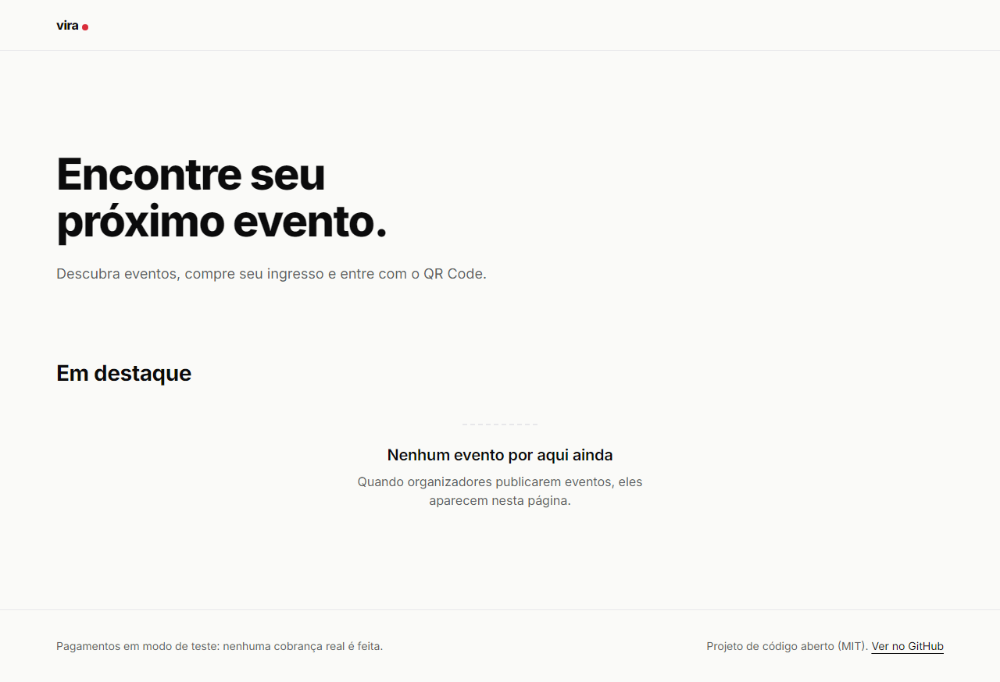
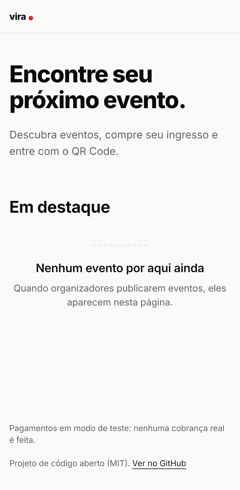

<!-- Espaço para o logo: entra na entrega N1 (fundação visual) como docs/assets/logo.svg -->

<h1 align="center">Vira</h1>

<p align="center">
  Plataforma open source de venda de ingressos para eventos.<br>
  <a href="README.en.md">Read in English</a>
</p>

<p align="center">
  <a href="https://github.com/joaomenkdev-cloud/vira/actions/workflows/ci.yml"></a>
  <a href="LICENSE"></a>
  
</p>

> **Em construção.** O projeto está na fase de planejamento: a arquitetura, o modelo de dados, o modelo de segurança e o design system estão documentados, e o código começa no próximo marco. Acompanhe pelo [roadmap](docs/ROADMAP.md) e pelo [diário de bordo](PROGRESS.md).

## O que é

Organizadores publicam eventos, o público descobre e compra, recebe um **ingresso digital com QR Code**, e o organizador valida o QR na entrada.

O Vira é um projeto de portfólio construído como se fosse para produção: arquitetura em camadas, segurança e proteção de dados (LGPD) pensadas desde o primeiro commit, e uma identidade visual própria.

**A demo nunca movimenta dinheiro real:** os pagamentos usam o modo de teste do Stripe.

## Destaques técnicos

- **Estoque à prova de corrida:** reserva de 10 minutos com update condicional atômico e `CHECK` no banco; teste com compras simultâneas da última vaga.
- **Pagamento confiável:** pedido só vira pago pelo webhook do Stripe com assinatura verificada; webhooks processados uma única vez; pedidos com chave de idempotência.
- **Ingresso infalsificável:** o QR carrega um token assinado com HMAC, nunca um id adivinhável; check-in de uso único.
- **Segurança por padrão:** OWASP ASVS nível 2 e API Security Top 10 como referência, autorização testada em toda rota, refresh token rotativo com detecção de reuso.
- **Privacidade:** só nome e e-mail do comprador e nome do titular; exportação e exclusão de conta; nada de dados pessoais em logs.

## Stack

| Camada | Tecnologias |
| --- | --- |
| Monorepo | TypeScript, pnpm workspaces, Turborepo |
| API | NestJS (monólito modular), Zod, OpenAPI, RFC 9457 |
| Dados | PostgreSQL 16, Prisma, Redis, BullMQ |
| Web | Next.js (App Router), Tailwind CSS, design system próprio sobre shadcn/ui |
| Pagamentos | Stripe (modo de teste) — Payment Intents e webhooks |
| Infra | Cloudflare R2, Resend, Sentry; Vercel, Render, Neon, Upstash |
| Testes | Vitest, Supertest, Testcontainers, Stripe CLI, Playwright + axe |
| Qualidade | GitHub Actions, CodeQL, Dependabot, gitleaks, Conventional Commits |

## Prints

| Home (desktop) | Home (mobile) |
| --- | --- |
|  |  |

Página do evento e ingresso entram com as próximas telas (marco Núcleo).

## Roadmap resumido

| Marco | Conteúdo | Estado |
| --- | --- | --- |
| 0. Fundação | Planejamento, ferramentas, esqueletos da API, do worker e do web, auditoria | Em andamento |
| 1. Núcleo | Design system, autenticação, eventos, vitrine, painel do organizador | Planejado |
| 2. MVP v1.0 | Reserva, Stripe, ingresso, check-in, LGPD, deploy da demo | Planejado |
| 3. Evolução | Gratuitos, reembolsos, Pix, check-in offline, modo escuro e mais | Ideias |

Detalhes e critérios de pronto em [docs/ROADMAP.md](docs/ROADMAP.md).

## Documentação

| Documento | Conteúdo |
| --- | --- |
| [Arquitetura](docs/ARCHITECTURE.md) | Componentes, módulos, camadas e fluxo de compra |
| [Modelo de dados](docs/DATA_MODEL.md) | Entidades, índices, máquinas de estado e dados pessoais |
| [API](docs/API.md) | Endpoints, papéis e respostas |
| [Modelo de segurança](docs/SECURITY_MODEL.md) | STRIDE, controles e checklist ASVS |
| [Privacidade](docs/PRIVACY.md) | Inventário LGPD, retenção e direitos do titular |
| [Design system](docs/DESIGN.md) | Tokens, componentes, wireframes e acessibilidade |
| [Briefing visual](docs/DESIGN_BRIEF.md) | Fonte da verdade da identidade visual |
| [ADRs](docs/adr/) | Decisões de arquitetura |

## Como rodar

A API está em construção (esqueleto, banco e infraestrutura local). Com Docker:

```bash
corepack enable
pnpm install
pnpm infra:up
cp apps/api/.env.example apps/api/.env
pnpm --filter @vira/api db:deploy
pnpm --filter @vira/api dev
```

Detalhes em [CONTRIBUTING.md](CONTRIBUTING.md).

## Contribuindo

Veja o [guia de contribuição](CONTRIBUTING.md) e o [código de conduta](CODE_OF_CONDUCT.md). Vulnerabilidades: siga a [política de segurança](SECURITY.md) e nunca abra issue pública.

## Licença

[MIT](LICENSE)
