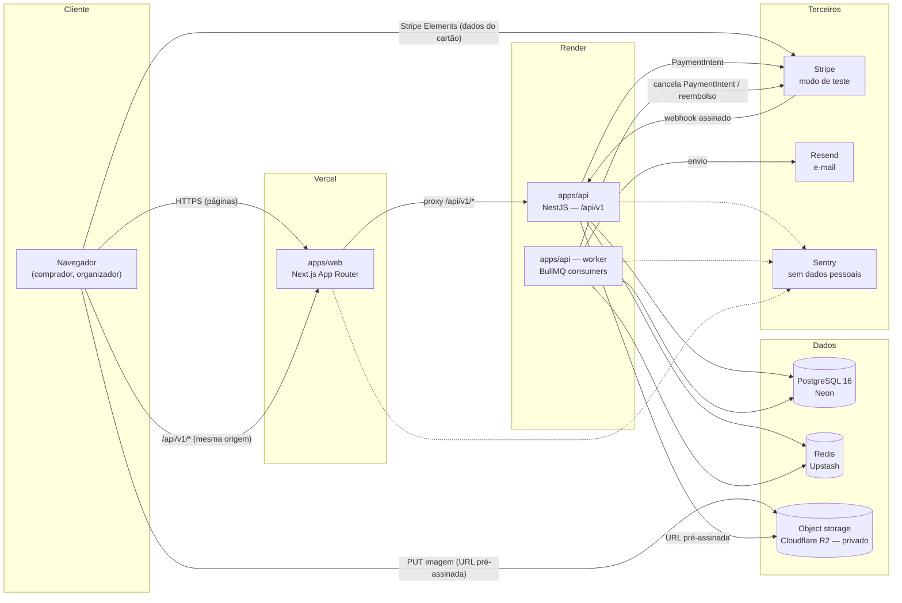
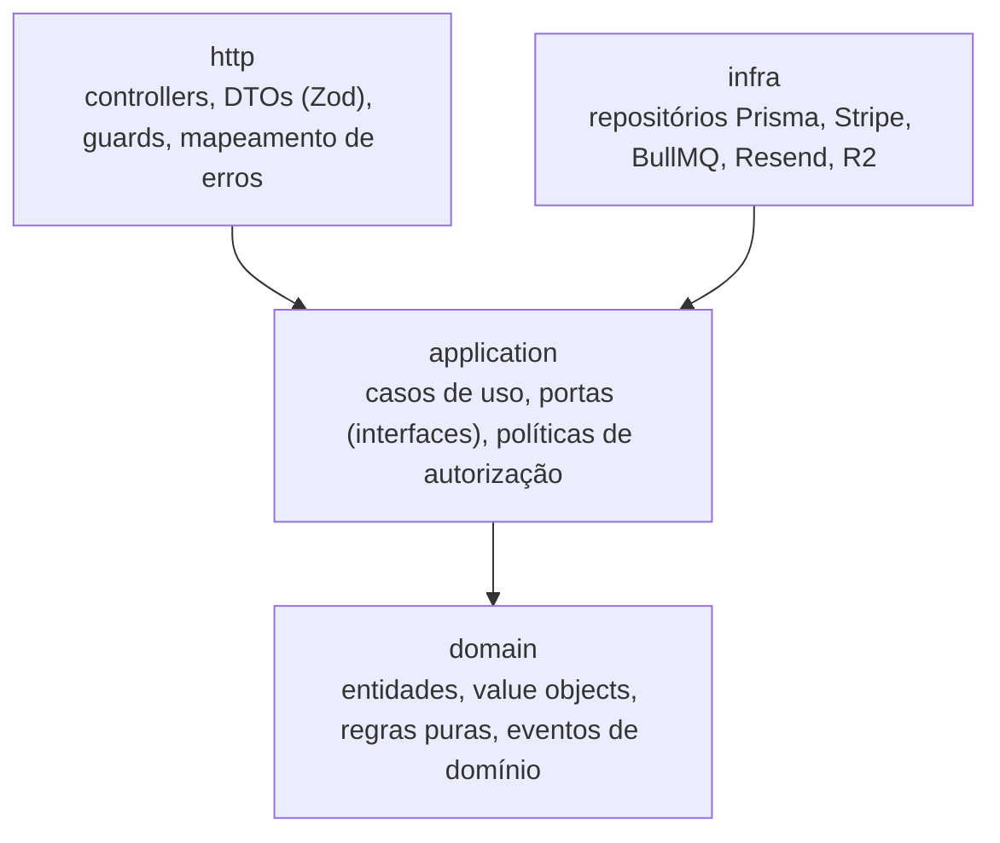
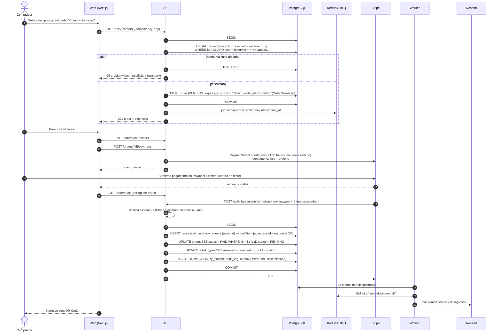
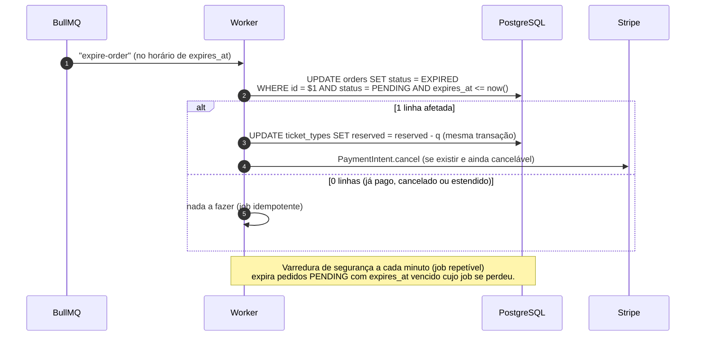
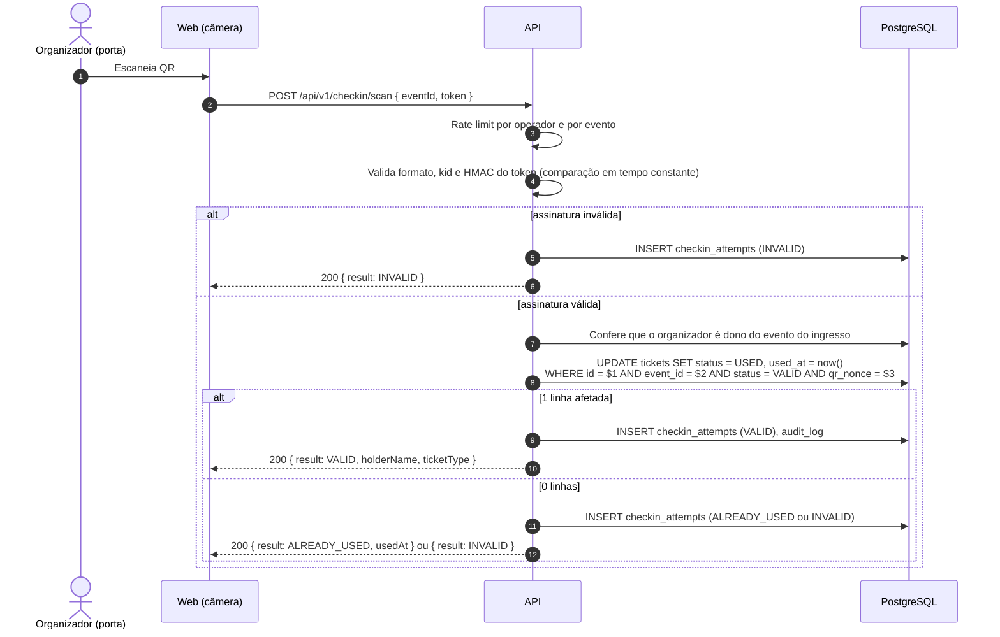

# Arquitetura

Visão técnica do Vira: componentes, módulos, camadas e o fluxo de compra de ponta a ponta. As decisões que sustentam este desenho estão nos [ADRs](adr/).

## 1. Visão geral

O Vira é um **monólito modular** em TypeScript (NestJS) com um **worker** separado para tarefas assíncronas, uma aplicação **Next.js** para o público e organizadores, e integrações externas atrás de interfaces.



Pontos-chave:

- **Mesma origem para o navegador.** O Next.js faz proxy de `/api/v1/*` para a API, então os cookies de sessão são first-party no domínio do web app (`SameSite=Lax` funciona, sem CORS no caminho do navegador). Webhooks do Stripe chegam direto no domínio da API. Ver [ADR-0005](adr/0005-autenticacao-e-tokens.md).
- **Nenhum dado de cartão passa pelos nossos servidores.** O Payment Element do Stripe roda em iframe no navegador e fala direto com o Stripe.
- **A API nunca confia em valores do cliente.** Preço, total, disponibilidade e dono do recurso são sempre lidos do banco.
- **O worker é o mesmo código** (`apps/api`) iniciado com outro entrypoint (`main.worker.ts`), compartilhando módulos e camadas. Em ambientes de custo zero ele pode rodar embutido no processo da API (`WORKER_MODE=embedded`). Ver [ADR-0011](adr/0011-hospedagem.md).

## 2. Estrutura do monorepo

```text
vira/
├── apps/
│   ├── api/                 # NestJS: HTTP API + worker (dois entrypoints)
│   │   ├── src/
│   │   │   ├── main.ts           # API HTTP
│   │   │   ├── bootstrap/        # AppModule, configuração do app HTTP, run()
│   │   │   ├── main.worker.ts    # consumidores BullMQ + agendamentos
│   │   │   ├── modules/          # um diretório por módulo de negócio
│   │   │   └── platform/         # transversal: config, logger, errors, db, queue, security
│   │   ├── prisma/               # schema.prisma, migrations/, seed
│   │   └── test/                 # integração (Supertest + Testcontainers)
│   └── web/                 # Next.js App Router + Tailwind
├── packages/
│   ├── shared/              # schemas Zod, tipos de contrato da API, constantes de domínio
│   ├── ui/                  # design system: tokens, tema Tailwind, componentes
│   └── config/              # tsconfig, eslint, vitest e prettier compartilhados
├── docs/                    # esta documentação + ADRs
└── .github/                 # CI, templates, dependabot
```

Ferramentas: pnpm workspaces + Turborepo ([ADR-0001](adr/0001-monorepo.md)). `packages/shared` é a única dependência compartilhada entre `api` e `web`; o `web` nunca importa código da `api`.

## 3. Módulos de negócio

| Módulo | Responsabilidade | Depende de |
| --- | --- | --- |
| `auth` | Cadastro, login com senha, OAuth (Google, GitHub), sessões, refresh rotativo, CSRF, verificação de e-mail, redefinição de senha. | `users`, `audit` |
| `users` | Perfil, papéis (BUYER, ORGANIZER, ADMIN), perfil de organizador, exportação e anonimização de conta (LGPD). | `audit` |
| `events` | Lado do organizador: rascunho, edição, publicação e cancelamento de eventos; tipos de ingresso; upload de imagem. | `users`, `audit` |
| `catalog` | Lado público (somente leitura): listagem, busca e detalhe de eventos publicados, paginação por cursor. | — (lê projeções de `events`) |
| `orders` | Reserva de estoque, pedidos, expiração, extensão única da reserva, idempotência. | `catalog` (leitura), `payments`, `audit` |
| `payments` | PaymentIntents, webhook do Stripe, registro de eventos recebidos, reembolso de pagamento tardio. | `orders` (via eventos de domínio), `audit` |
| `tickets` | Emissão de ingressos para pedidos pagos, token do QR (HMAC), envio por e-mail. | `orders` (via eventos de domínio) |
| `checkin` | Validação do QR/código na entrada, transição única VALID → USED, registro de tentativas. | `tickets`, `events` (autorização), `audit` |
| `audit` | Log append-only de ações sensíveis. | — |

Regras entre módulos:

- Um módulo só acessa outro pela **API pública** dele (`<modulo>/application/public-api.ts`) ou por **eventos de domínio** — nunca pelas tabelas ou repositórios do outro.
- Fluxos que cruzam módulos com efeitos colaterais (ex.: pedido pago → emitir ingresso → enviar e-mail) usam **eventos de domínio** gravados na **outbox** na mesma transação (seção 6).
- As fronteiras são verificadas no CI em duas camadas: o ESLint barra imports por **pacote** (`@vira/config/eslint`) e o `dependency-cruiser` barra imports por **caminho** (`apps/api/.dependency-cruiser.js`), ambos rodando no `lint`.

## 4. Camadas

Cada módulo segue a mesma estrutura, com dependências apontando **para dentro**:



| Camada | Pode importar | Não pode importar | Testes |
| --- | --- | --- | --- |
| `domain` | apenas `domain` do próprio módulo e `packages/shared` | NestJS, Prisma, Stripe, qualquer I/O | Unitários puros (Vitest), sem mocks |
| `application` | `domain`, portas declaradas na própria camada | Prisma, SDKs externos, `http` | Unitários com adaptadores em memória |
| `infra` | `application` (implementa as portas), `domain`, Prisma, SDKs | `http` | Integração com Testcontainers (Postgres, Redis) e fakes de rede |
| `http` | `application`, `packages/shared` | `infra` diretamente, Prisma | Integração com Supertest |

Exemplo do módulo `orders`:

```text
modules/orders/
├── domain/
│   ├── order.ts                  # entidade + máquina de estados
│   ├── money.ts                  # value object em centavos (inteiro)
│   ├── reservation-policy.ts     # 10 min, extensão única, limite por pedido
│   └── events.ts                 # OrderPaid, OrderExpired...
├── application/
│   ├── ports/
│   │   ├── order-repository.ts
│   │   ├── inventory.ts          # reserve/release atômicos
│   │   ├── payment-gateway.ts    # interface implementada em payments/infra
│   │   └── clock.ts
│   ├── create-order.ts           # caso de uso
│   ├── expire-order.ts
│   ├── extend-reservation.ts
│   └── public-api.ts
├── infra/
│   ├── prisma-order-repository.ts
│   ├── prisma-inventory.ts       # UPDATE condicional
│   └── expire-order.processor.ts # consumidor BullMQ
└── http/
    ├── orders.controller.ts
    └── dto.ts                    # reexporta schemas de packages/shared
```

Integrações externas (`PaymentGateway`, `Mailer`, `ObjectStorage`, `Clock`, `IdGenerator`) são **portas** com um adaptador real e um adaptador falso em memória. Os testes de `application` e a maior parte dos de integração rodam **sem rede**.

## 5. Fluxo de compra

### 5.1 Sequência



### 5.2 Expiração e casos de borda



| Situação | Comportamento |
| --- | --- |
| Duas pessoas disputam a última vaga | O `UPDATE` condicional serializa no nível da linha; exatamente uma reserva vence, a outra recebe `409`. Coberto por teste de concorrência com N requisições simultâneas contra Postgres real (Testcontainers). |
| Cliente reenvia `POST /orders` (rede instável) | Mesma `Idempotency-Key` + mesmo corpo → retorna o mesmo pedido (`200`). Mesma chave com corpo diferente → `422` (`idempotency-key-reused`). |
| Stripe reenvia o mesmo webhook | `INSERT` em `processed_webhook_events` conflita → responde `200` sem reprocessar. |
| Webhooks fora de ordem | Transições são condicionais (`WHERE status = ...`); eventos que não se aplicam ao estado atual são registrados e ignorados. |
| Pagamento confirmado depois que a reserva expirou | Tenta re-reservar o estoque na mesma transação. Se houver vaga → `PAID` normalmente. Se não → pedido vai para `REFUNDED` e um job pede reembolso total ao Stripe; o comprador recebe e-mail explicando. |
| Pagamento recusado | `payment_intent.payment_failed` não muda o pedido; o comprador pode tentar outro cartão até a reserva expirar. |
| Comprador pede mais tempo | Uma única extensão de +10 min (`POST /orders/{id}/extend`), só se `PENDING` e faltando ≤ 2 min; reagenda o job. Atende à WCAG 2.2.1. |
| Job de expiração perdido (Redis reiniciado) | A varredura periódica no worker cobre; o banco é a fonte da verdade, nunca o Redis. |

### 5.3 Check-in



O resultado do check-in é uma resposta de negócio, por isso volta com `200` e um `result` explícito; erros HTTP ficam para falhas de autenticação, autorização ou validação do corpo.

## 6. Mensageria e jobs

| Fila | Produtor | Consumidor | Garantias |
| --- | --- | --- | --- |
| `orders.expire` | API (ao reservar/estender) | worker | Job com `jobId = orderId:expiresAt` (deduplicado), idempotente pelo `UPDATE` condicional |
| `orders.sweep` | agendamento repetível (1 min) | worker | Rede de segurança da expiração |
| `outbox.dispatch` | poller em processo (a cada `OUTBOX_POLL_INTERVAL_MS`, 5 s por padrão) | worker | Lê `outbox_messages` devidas com `FOR UPDATE SKIP LOCKED`, publica no BullMQ e marca como despachada na mesma transação |
| `email.send` | outbox | worker | Retentativas exponenciais (5×), chave de idempotência por mensagem |
| `payments.refund` | webhook (pagamento tardio) | worker | Idempotency key do Stripe = `refund:{orderId}` |

**Poller, não job repetível.** O despacho da outbox roda num poller em processo (`OutboxPoller`), não num job repetível do BullMQ: assim a outbox não depende do Redis para ser lida, e uma queda do Redis só faz as mensagens esperarem. As rodadas **nunca se sobrepõem** (uma rodada lenta faz a seguinte ser ignorada) e várias instâncias podem rodar juntas, porque `SKIP LOCKED` entrega cada mensagem a um só despachante. O poller também apaga mensagens entregues há mais de 7 dias, uma vez por hora. Substitui o "agendamento repetível + gatilho pós-commit" do desenho inicial; o gatilho foi dispensado porque 5 s de latência bastam.

**Publicação e retentativas.** O id da mensagem é o `jobId` do BullMQ, então publicar de novo (por exemplo depois de uma queda entre publicar e registrar a entrega) não cria um segundo job. Falha ao publicar registra o erro (classe e mensagem truncada, sem dados pessoais), incrementa `attempts` e adia a próxima tentativa com backoff exponencial (5 s, 10 s, 20 s... até 15 min). Após 10 tentativas a mensagem fica parada para inspeção, em vez de ser tentada para sempre.

**Processos.** O worker é o mesmo código da API com outro entrypoint (`main.worker.ts`, `WorkerModule`). Com `WORKER_MODE=embedded` o poller sobe dentro da API (para hospedagem sem background worker, ADR-0011); com `separate` (padrão) só o worker despacha.

**Outbox transacional:** efeitos colaterais (e-mails, reembolsos) nunca são disparados de dentro de uma transação de banco. O evento é gravado em `outbox_messages` na mesma transação da mudança de estado e despachado depois. Assim não existe "pedido pago sem e-mail" nem "e-mail de pedido que deu rollback".

Rate limiting usa Redis (`@nestjs/throttler` com storage Redis) e é independente das filas.

## 7. Preocupações transversais (`platform/`)

| Tema | Decisão |
| --- | --- |
| Configuração | Variáveis de ambiente validadas com Zod no boot; a aplicação **não sobe** com configuração inválida. `.env.example` documenta tudo, sem valores reais. |
| Logs | `pino` (via `nestjs-pino`), JSON estruturado, `requestId` no topo de toda linha (gerado, ou aceito de `X-Request-Id` quando tem formato seguro), sem headers, corpo, query string ou IP do cliente, redação de `authorization`, `cookie`, `set-cookie`, `password`, `token`, `email`, `name`. Nenhum dado pessoal em log. |
| Erros | Filtro global converte exceções em `application/problem+json` (RFC 9457) com `type`, `title`, `status`, `detail`, `instance` e `requestId`. Erros 5xx nunca vazam stack ou mensagem interna. |
| Validação | Schemas Zod de `packages/shared` validam corpo, query e params na borda (`http`) com o suporte nativo a Standard Schema do NestJS 12 (`@Body({ schema })` + `StandardSchemaValidationPipe`). O domínio revalida invariantes. |
| OpenAPI | Gerado a partir dos schemas Zod e servido em `/docs` (desligado em produção ou protegido, configurável). |
| Segurança HTTP | Helmet, CSP (no web, com nonce), CORS restrito à origem do web, limite de body (100 kB JSON; webhook com body bruto), `trust proxy` configurado para o provedor. Detalhes em [SECURITY_MODEL.md](SECURITY_MODEL.md). |
| Tempo e dinheiro | Datas em UTC (`timestamptz`) com o fuso IANA do evento salvo à parte; formatação para exibição sempre no fuso do evento. Dinheiro em centavos (`int`), moeda `BRL`. |
| IDs e tempo | Portas `IdGenerator` (UUID v7, pacote `uuid`) e `Clock` em `platform/runtime`, injetadas nos casos de uso para que os testes controlem ids e horário. UUID v7 (ordenáveis) como chave primária; nunca expostos como única proteção de um recurso (autorização sempre verificada). Códigos públicos legíveis (`VIRA-XXXX-XXXX`) são aleatórios (Crockford Base32, 40 bits) e não substituem autenticação. |
| Observabilidade | Sentry (API, worker, web) com `sendDefaultPii: false`, `beforeSend` que remove usuário, cookies, headers e corpo; health checks `/health/live` e `/health/ready`. |

## 8. Aplicação web

- **Next.js App Router** com Server Components para páginas públicas (vitrine e página do evento renderizadas no servidor, boas para SEO e desempenho) e Client Components só onde há interação (seletor de ingressos, checkout, câmera do check-in).
- Busca de dados no servidor pelo mesmo cliente HTTP tipado (`packages/shared`), repassando os cookies da requisição.
- Rotas por área: `(public)` vitrine e evento; `(account)` meus ingressos, conta e privacidade; `(checkout)` layout sem navegação; `(organizer)` painel e check-in.
- Estilos só via tokens ([DESIGN.md](DESIGN.md)). Enquanto o `packages/ui` não existe (entrega N1), os tokens ficam em `apps/web/src/app/tokens.css` e são expostos ao Tailwind em `globals.css`; um teste recalcula o contraste de cada par de cores a partir desse arquivo.

### Proxy da API e cabeçalhos de segurança

- **Mesma origem:** `next.config.ts` reescreve `/api/v1/*` para `API_ORIGIN` (`beforeFiles`, antes de qualquer página). O navegador só fala com o domínio do web, então os cookies de sessão são first-party e não há CORS ([ADR-0005](adr/0005-autenticacao-e-tokens.md)). `API_ORIGIN` é lido **no build** (o destino do rewrite é fixado nele); fora de deploys o padrão é a API local, na Vercel é obrigatório, e só aceita `http` para loopback.
- **CSP com nonce por requisição:** `src/proxy.ts` (o antigo `middleware`, renomeado no Next.js 16) gera o nonce, coloca a CSP na requisição (para o Next marcar os próprios scripts) e na resposta. Por isso as páginas são renderizadas a cada requisição (o layout lê `headers()`), o que descarta cache estático e Partial Prerendering; é o custo de uma CSP estrita sem `unsafe-inline`.
- **Demais cabeçalhos** (HSTS, `nosniff`, `X-Frame-Options`, `Referrer-Policy`, `Permissions-Policy`, COOP) vêm de `next.config.ts`; `X-Powered-By` é desligado.

## 9. Ambientes

| Ambiente | Web | API + worker | Banco | Redis | Storage | E-mail | Stripe |
| --- | --- | --- | --- | --- | --- | --- | --- |
| Local | `next dev` | `nest start --watch` | Postgres 16 (Docker) | Redis (Docker) | SeaweedFS (Docker, [ADR-0012](adr/0012-armazenamento-local-seaweedfs.md)) | Mailpit (Docker) | modo de teste + Stripe CLI (`stripe listen`) |
| Testes (CI) | — | Supertest | Testcontainers | Testcontainers | fake em memória | fake em memória | fake + fixtures de webhook assinadas |
| Demo pública | Vercel | Render | Neon | Upstash | Cloudflare R2 | Resend | modo de teste |

A demo pública **nunca** usa chaves live do Stripe: a configuração rejeita no boot qualquer chave que não comece com `sk_test_`/`pk_test_` enquanto `PAYMENTS_MODE=test` (padrão e único valor aceito no MVP).
