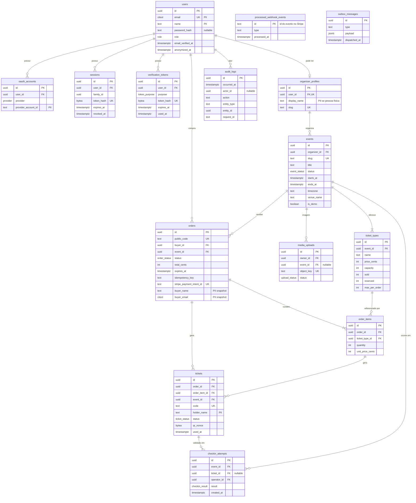
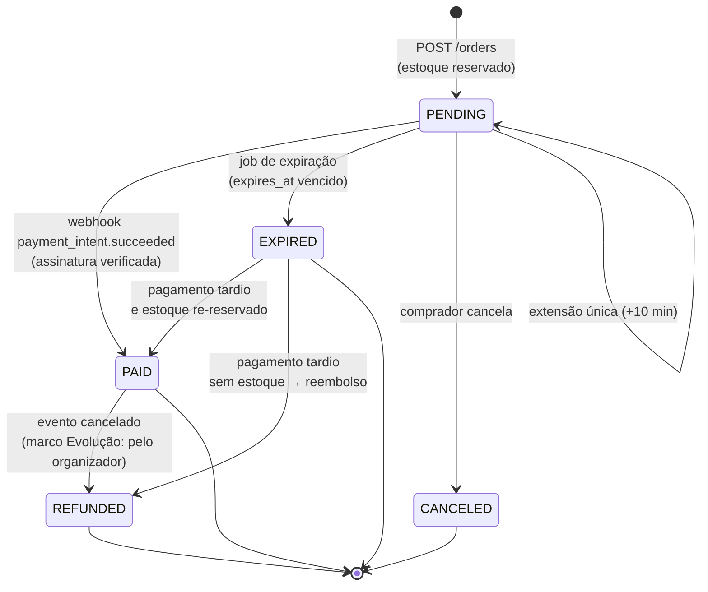
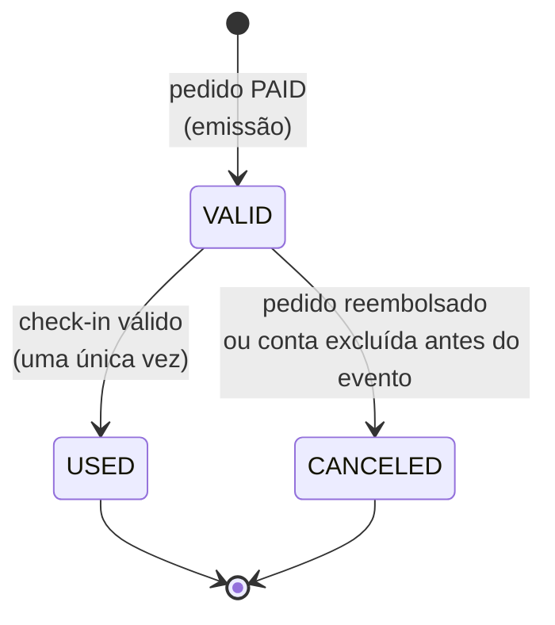
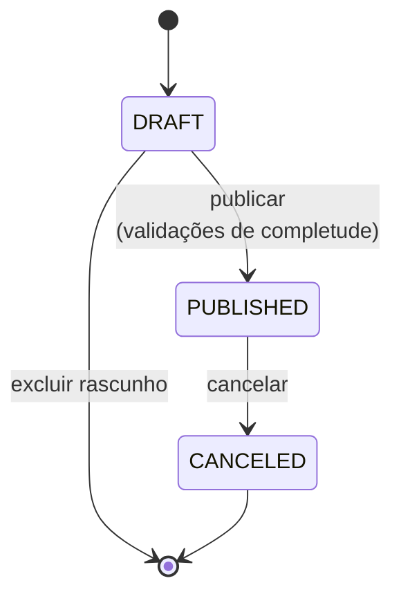

# Modelo de dados

PostgreSQL 16 com Prisma e migrations versionadas ([ADR-0004](adr/0004-prisma.md)). Este documento é o desenho de referência; o `schema.prisma` é a implementação e deve ser mantido em sincronia.

## Convenções

- **Chaves primárias:** `uuid` v7 gerado na aplicação (ordenável por tempo, bom para índices e paginação por cursor).
- **Nomes:** tabelas e colunas em `snake_case` no banco (`@@map`/`@map`), `camelCase` no código.
- **Datas:** `timestamptz` sempre em UTC. Eventos guardam também o fuso IANA (`America/Sao_Paulo`) para exibição.
- **Dinheiro:** `integer` em centavos + coluna `currency` (`BRL` no MVP). Nunca `float`/`decimal` para preço.
- **Exclusão:** dados de negócio não são apagados fisicamente; pessoas são **anonimizadas** (ver [PRIVACY.md](PRIVACY.md)).
- **Invariantes no banco**, não só na aplicação: `CHECK`, `UNIQUE` e chaves estrangeiras para as regras que não podem falhar.
- Coluna **PII** = dado pessoal segundo a LGPD. A coluna "Dado pessoal" nas tabelas abaixo marca cada uma.

## Diagrama ER



## Entidades

### `users`

| Campo | Tipo | Regras | Dado pessoal |
| --- | --- | --- | --- |
| `id` | uuid | PK | Pseudônimo |
| `email` | citext | `UNIQUE`; normalizado (trim, minúsculas) | **Sim** |
| `name` | text | 1–120 caracteres | **Sim** |
| `password_hash` | text | argon2id (PHC string); `NULL` para contas só OAuth | Sim (credencial) |
| `role` | enum `Role` | `BUYER` (padrão), `ORGANIZER`, `ADMIN`. Papéis são cumulativos: ORGANIZER também compra; ADMIN também organiza. | Não |
| `email_verified_at` | timestamptz | `NULL` até verificar | Não |
| `failed_login_count`, `locked_until` | int, timestamptz | Bloqueio progressivo após falhas | Não |
| `created_at`, `updated_at` | timestamptz | | Não |
| `anonymized_at` | timestamptz | Preenchido na exclusão de conta | Não |

Índices: `UNIQUE(email)`. Ao anonimizar: `email = 'deleted+<id>@invalid'`, `name = 'Conta excluída'`, `password_hash = NULL`, contas OAuth e sessões apagadas.

### `oauth_accounts`

| Campo | Tipo | Regras | Dado pessoal |
| --- | --- | --- | --- |
| `user_id` | uuid | FK → users, `ON DELETE CASCADE` | — |
| `provider` | enum | `GOOGLE`, `GITHUB` | Não |
| `provider_account_id` | text | `UNIQUE(provider, provider_account_id)` | **Sim** (identificador) |

Não guardamos tokens de acesso dos provedores: só usamos o perfil no login.

### `sessions` (refresh tokens)

| Campo | Tipo | Regras | Dado pessoal |
| --- | --- | --- | --- |
| `user_id` | uuid | FK → users, `ON DELETE CASCADE` | — |
| `family_id` | uuid | Agrupa a cadeia de rotações de um login | Não |
| `token_hash` | bytea | SHA-256 do token (32 bytes aleatórios); `UNIQUE`. O token em claro só existe no cookie. | Não |
| `expires_at` | timestamptz | Absoluto: 30 dias; ocioso: 7 dias | Não |
| `rotated_at` | timestamptz | Preenchido quando o token é trocado | Não |
| `revoked_at`, `revoke_reason` | timestamptz, enum | `LOGOUT`, `REUSE_DETECTED`, `PASSWORD_CHANGED`, `ACCOUNT_DELETED` | Não |

Índices: `UNIQUE(token_hash)`, `(user_id)`, `(family_id)`. **Detecção de reuso:** apresentar um token já rotacionado revoga a família inteira e registra `auth.refresh_reuse_detected` na auditoria. Limpeza diária remove sessões expiradas há mais de 30 dias.

### `verification_tokens`

Tokens de uso único para verificação de e-mail e redefinição de senha.

| Campo | Tipo | Regras |
| --- | --- | --- |
| `purpose` | enum | `EMAIL_VERIFICATION` (24 h), `PASSWORD_RESET` (30 min) |
| `token_hash` | bytea | SHA-256; `UNIQUE` |
| `expires_at`, `used_at` | timestamptz | Uso único (`UPDATE ... WHERE used_at IS NULL`) |

### `organizer_profiles`

| Campo | Tipo | Regras | Dado pessoal |
| --- | --- | --- | --- |
| `user_id` | uuid | FK, `UNIQUE` | — |
| `display_name` | text | Nome público do organizador (exibido na página do evento) | **Sim**, se for pessoa física |
| `slug` | text | `UNIQUE` | Possivelmente |

### `events`

| Campo | Tipo | Regras |
| --- | --- | --- |
| `organizer_id` | uuid | FK → organizer_profiles |
| `slug` | text | `UNIQUE`; gerado do título + sufixo aleatório curto |
| `title` | text | 3–120 caracteres |
| `description_md` | text | Markdown do organizador, até 20 000 caracteres |
| `description_html` | text | HTML **sanitizado** gerado no servidor a partir do markdown (allowlist de tags); nunca recebido do cliente |
| `status` | enum `EventStatus` | `DRAFT`, `PUBLISHED`, `CANCELED` (encerrado é derivado de `ends_at < now()`) |
| `starts_at`, `ends_at` | timestamptz | `CHECK (ends_at > starts_at)` |
| `timezone` | text | IANA, validado contra a lista do runtime |
| `venue_name`, `venue_address`, `venue_city`, `venue_state` | text | Endereço do local (não é dado pessoal) |
| `image_key` | text | Chave no bucket privado; servida via URL assinada/otimizada |
| `image_alt` | text | Obrigatório para publicar |
| `image_credit_author`, `image_credit_url`, `image_license` | text | Obrigatórios quando `is_demo = true` |
| `is_demo` | boolean | `true` só para eventos criados pelo seed |
| `published_at`, `canceled_at` | timestamptz | |

Índices: `UNIQUE(slug)`; `(status, starts_at)` para a vitrine; `(organizer_id, created_at)` para o painel; `GIN (title gin_trgm_ops)` (extensão `pg_trgm`) para busca; `(venue_city, starts_at) WHERE status = 'PUBLISHED'`.

Publicar exige: título, data futura, local, imagem com `alt`, ao menos um tipo de ingresso.

### `ticket_types`

| Campo | Tipo | Regras |
| --- | --- | --- |
| `event_id` | uuid | FK → events |
| `name`, `description` | text | Ex.: "Pista – Lote 1" |
| `price_cents` | int | `CHECK (price_cents >= 100)` — no MVP só ingressos pagos, mínimo R$ 1,00 (gratuitos no marco Evolução) |
| `currency` | char(3) | `BRL` |
| `capacity` | int | `CHECK (capacity > 0)` |
| `sold` | int | `CHECK (sold >= 0)` |
| `reserved` | int | `CHECK (reserved >= 0)` |
| `max_per_order` | int | Padrão 10, `CHECK (max_per_order BETWEEN 1 AND 20)` |
| `sales_start_at`, `sales_end_at` | timestamptz | Janela de vendas (opcional) |
| `sort_order` | int | |

**Invariante de estoque:** `CHECK (sold + reserved <= capacity)`. É a última linha de defesa: mesmo com um bug na aplicação, o banco recusa overbooking. A reserva usa um `UPDATE` condicional atômico ([ADR-0007](adr/0007-controle-de-estoque.md)):

```sql
UPDATE ticket_types
   SET reserved = reserved + $qty
 WHERE id = $id
   AND sold + reserved + $qty <= capacity
RETURNING id;
```

`capacity` não pode ser reduzida abaixo de `sold + reserved`; um tipo com vendas não pode ser excluído (só ocultado).

### `orders`

| Campo | Tipo | Regras | Dado pessoal |
| --- | --- | --- | --- |
| `public_code` | text | `VIRA-ORD-XXXX`, aleatório, `UNIQUE` | Não |
| `buyer_id` | uuid | FK → users | — |
| `event_id` | uuid | FK → events (um pedido = um evento) | — |
| `status` | enum `OrderStatus` | ver máquina de estados | Não |
| `total_cents` | int | Soma dos itens calculada no servidor; `CHECK (total_cents > 0)` | Não |
| `currency` | char(3) | `BRL` | Não |
| `expires_at` | timestamptz | `created_at + 10 min` (+10 min se estendido) | Não |
| `extension_count` | smallint | `CHECK (extension_count <= 1)` | Não |
| `idempotency_key` | text | Enviado pelo cliente; `UNIQUE(buyer_id, idempotency_key)` | Não |
| `request_hash` | bytea | SHA-256 do corpo normalizado, para detectar reuso da chave com outro corpo | Não |
| `stripe_payment_intent_id` | text | `UNIQUE`, nullable | Não |
| `buyer_name`, `buyer_email` | text, citext | Cópia no momento da compra (para o comprovante) | **Sim** |
| `paid_at`, `expired_at`, `canceled_at`, `refunded_at` | timestamptz | Carimbos das transições | Não |

Índices: `UNIQUE(public_code)`, `UNIQUE(buyer_id, idempotency_key)`, `UNIQUE(stripe_payment_intent_id)`, `(buyer_id, created_at DESC)` para "meus pedidos", `(status, expires_at) WHERE status = 'PENDING'` para a varredura de expiração, `(event_id, status)`.

Regra anti-açambarcamento: no máximo **1 pedido `PENDING` por comprador por evento** (`UNIQUE (buyer_id, event_id) WHERE status = 'PENDING'`).

### `order_items`

| Campo | Tipo | Regras |
| --- | --- | --- |
| `order_id` | uuid | FK → orders |
| `ticket_type_id` | uuid | FK → ticket_types |
| `quantity` | int | `CHECK (quantity BETWEEN 1 AND 20)`, ≤ `max_per_order` |
| `unit_price_cents` | int | Cópia do preço no momento da reserva |

`UNIQUE(order_id, ticket_type_id)`.

### `tickets`

| Campo | Tipo | Regras | Dado pessoal |
| --- | --- | --- | --- |
| `order_id`, `order_item_id`, `event_id`, `ticket_type_id` | uuid | FKs (`event_id` desnormalizado para o check-in) | — |
| `code` | text | `VIRA-XXXX-XXXX`, Crockford Base32 aleatório, `UNIQUE`. Referência legível para suporte e busca manual no check-in | Não |
| `holder_name` | text | Nome do titular, 1–120 caracteres | **Sim** |
| `status` | enum `TicketStatus` | `VALID`, `USED`, `CANCELED` | Não |
| `qr_nonce` | bytea | 16 bytes aleatórios; trocar invalida QR antigos ([ADR-0008](adr/0008-qr-code-assinado.md)) | Não |
| `used_at` | timestamptz | | Não |
| `checked_in_by` | uuid | FK → users (operador) | — |
| `issued_at`, `canceled_at` | timestamptz | | Não |

Índices: `UNIQUE(code)`, `(order_id)`, `(event_id, status)`. `CHECK ((status = 'USED') = (used_at IS NOT NULL))`.

Tickets só são criados na transação que marca o pedido como `PAID`. Não existe caminho de código que crie ticket para pedido em outro estado; um trigger `BEFORE INSERT` confere `orders.status = 'PAID'` como defesa adicional.

### `checkin_attempts`

Registro de toda tentativa de validação (válida ou não), para auditoria e detecção de fraude.

| Campo | Tipo | Regras |
| --- | --- | --- |
| `event_id` | uuid | Evento em que a leitura foi feita |
| `ticket_id` | uuid | Nullable (token inválido não identifica ingresso) |
| `operator_id` | uuid | Usuário que escaneou |
| `result` | enum | `VALID`, `ALREADY_USED`, `INVALID`, `WRONG_EVENT` |
| `method` | enum | `QR`, `CODE` |

Índice: `(event_id, created_at)`. Retenção: 90 dias após o fim do evento.

### `processed_webhook_events`

| Campo | Tipo | Regras |
| --- | --- | --- |
| `id` | text | PK = `event.id` do Stripe (`evt_...`) |
| `type` | text | Ex.: `payment_intent.succeeded` |
| `processed_at` | timestamptz | |

Não guardamos o payload (pode conter dados de cobrança). O `INSERT` acontece na mesma transação do efeito: se a transação falhar, o Stripe reenvia e o evento é processado de novo; se tiver sucesso, reenvios conflitam na PK e são ignorados. Retenção: 90 dias (o Stripe só reenvia por até 3 dias).

### `outbox_messages`

| Campo | Tipo | Regras |
| --- | --- | --- |
| `type` | text | `CHECK` no formato `area.evento`. Catálogo em `apps/api/src/modules/outbox/domain/outbox-catalog.ts`, que também fixa a fila de destino e o schema do payload. Ex.: `orders.paid`, `tickets.issued`, `orders.refund_requested` |
| `payload` | jsonb | Somente IDs — nunca dados pessoais; o consumidor busca o resto. `CHECK`: sempre um objeto JSON; schema estrito por tipo na aplicação |
| `created_at` | timestamptz | |
| `available_at` | timestamptz | Momento da próxima tentativa; começa igual a `created_at` e avança com o backoff a cada falha |
| `dispatched_at` | timestamptz | `NULL` até a entrega. `CHECK`: só pode ser preenchido com `attempts > 0` |
| `attempts`, `last_error` | int, text | `attempts >= 0` (`CHECK`). `last_error`: classe e mensagem truncada em 200 caracteres, em uma linha |

Índice composto `(dispatched_at, available_at, created_at)`, que atende a consulta do despachante (não entregues, já devidas, mais antigas primeiro); o Prisma não expressa índice parcial. Mensagens com 10 tentativas ficam paradas. Mensagens despachadas são removidas após 7 dias.

### `audit_logs`

Append-only ([ARCHITECTURE.md](ARCHITECTURE.md#7-preocupações-transversais-platform)).

| Campo | Tipo | Regras |
| --- | --- | --- |
| `occurred_at` | timestamptz | |
| `actor_id` | uuid | Nullable (sistema/webhook). Pseudônimo: continua válido após a anonimização do usuário |
| `actor_role` | text | `SYSTEM`, `BUYER`, `ORGANIZER` ou `ADMIN`; `CHECK`: `SYSTEM` se e somente se `actor_id` é `NULL` |
| `action` | text | `CHECK` no formato `area.acao`. O catálogo completo, com o tipo de entidade e o schema de `metadata` de cada ação, está em `apps/api/src/modules/audit/domain/audit-catalog.ts`. Ex.: `auth.login_succeeded`, `auth.refresh_reuse_detected`, `event.published`, `order.paid`, `order.refunded`, `ticket.checked_in`, `user.data_exported`, `user.anonymized`, `admin.role_changed` |
| `entity_type`, `entity_id` | text, uuid | Tipo fixado por ação no catálogo (`user`, `session`, `event`, `order`, `payment`, `ticket`); `entity_id` nulo quando a entidade não existe (ex.: login com e-mail desconhecido) |
| `request_id` | text | Correlaciona com os logs |
| `metadata` | jsonb | Sem dados pessoais: schema estrito por ação (chaves desconhecidas são rejeitadas); `CHECK` garante objeto JSON |

Garantias: triggers `BEFORE UPDATE OR DELETE` (por linha) e `BEFORE TRUNCATE` levantam exceção para qualquer papel, inclusive o dono da tabela; `REVOKE UPDATE, DELETE, TRUNCATE ... FROM PUBLIC`; em produção o papel da aplicação recebe só `INSERT` e `SELECT` (entrega V11). Testado contra Postgres real. Índices: `(entity_type, entity_id, occurred_at)`, `(actor_id, occurred_at)`, `(action, occurred_at)`. Retenção: 5 anos.

### `media_uploads`

| Campo | Tipo | Regras |
| --- | --- | --- |
| `owner_id` | uuid | Organizador que pediu a URL |
| `event_id` | uuid | Preenchido ao confirmar |
| `object_key` | text | `events/<eventId>/<uuid>.<ext>` gerado pelo servidor, `UNIQUE` |
| `content_type` | text | `image/jpeg`, `image/png`, `image/webp` |
| `max_bytes` | int | 5 MB |
| `status` | enum | `PENDING`, `CONFIRMED`, `REJECTED` |
| `expires_at` | timestamptz | URL válida por 5 min |

Na confirmação o servidor faz `HEAD` no objeto, confere tamanho e tipo real (magic bytes), gera variantes e o `blurDataURL`. Uploads `PENDING` vencidos são apagados por job.

## Máquinas de estado

### Pedido



| De → Para | Gatilho | Efeito no estoque | Quem pode |
| --- | --- | --- | --- |
| — → `PENDING` | `POST /orders` | `reserved += q` | BUYER autenticado |
| `PENDING` → `PAID` | webhook verificado | `reserved -= q`, `sold += q`; emite tickets | Somente o webhook |
| `PENDING` → `EXPIRED` | job/varredura | `reserved -= q`; cancela PaymentIntent | Somente o worker |
| `PENDING` → `CANCELED` | `POST /orders/{id}/cancel` | `reserved -= q`; cancela PaymentIntent | Dono do pedido |
| `EXPIRED` → `PAID` | webhook tardio com estoque | `sold += q` (condicional) | Somente o webhook |
| `EXPIRED` → `REFUNDED` | webhook tardio sem estoque | — ; job de reembolso | Somente o webhook/worker |
| `PAID` → `REFUNDED` | cancelamento do evento | `sold -= q`; tickets → `CANCELED` | Organizador/Admin (Evolução) |

Toda transição é um `UPDATE ... WHERE status = <origem>`; zero linhas afetadas significa que outra transição venceu, e a operação é tratada como idempotente.

### Ingresso



| Leitura no check-in | Resposta |
| --- | --- |
| Token com assinatura válida, ingresso `VALID`, evento correto, nonce atual | `VALID` → ingresso vira `USED` |
| Token válido, ingresso `USED` | `ALREADY_USED` + horário do primeiro uso |
| Token válido, mas de outro evento | `WRONG_EVENT` (exibido como inválido para este evento) |
| Assinatura inválida, nonce antigo, ingresso `CANCELED` ou inexistente | `INVALID` |

### Evento



`PUBLISHED` com `ends_at < now()` é exibido como "Encerrado" (estado derivado, sem job). Evento publicado com vendas não pode ser excluído.

## Dados pessoais — resumo

| Tabela | Colunas com dado pessoal | Finalidade |
| --- | --- | --- |
| `users` | `email`, `name`, `password_hash` | Conta, login, comunicação transacional |
| `oauth_accounts` | `provider_account_id` | Login social |
| `organizer_profiles` | `display_name` (se pessoa física) | Identificar quem organiza o evento |
| `orders` | `buyer_name`, `buyer_email` | Comprovante e envio dos ingressos |
| `tickets` | `holder_name` | Identificar o titular na entrada |

Nenhuma outra tabela guarda dado pessoal direto. IDs (`user_id`, `actor_id`) são pseudônimos. Inventário completo, bases legais e retenção em [PRIVACY.md](PRIVACY.md).
