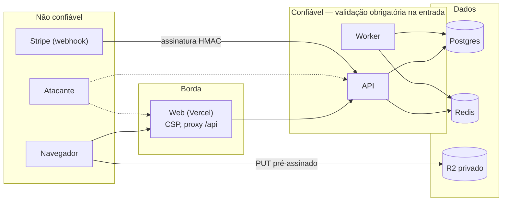

# Modelo de segurança

Referências: **OWASP ASVS 5.0, nível 2**, **OWASP API Security Top 10 (2023)** e **LGPD** (ver [PRIVACY.md](PRIVACY.md)). Para relatar uma vulnerabilidade, veja o [SECURITY.md](../SECURITY.md).

Este documento é vivo: cada PR que cria uma superfície nova (rota, integração, fila) atualiza a seção correspondente, e cada controle aponta para o teste que o prova.

## 1. Ativos e atores

| Ativo | Por que importa |
| --- | --- |
| Estoque de ingressos | Overbooking é falha de negócio grave e irreversível na porta do evento. |
| Status do pedido | Marcar um pedido como pago sem pagamento = ingresso grátis. |
| Token do QR | Quem tem um token válido entra no evento. |
| Sessões e credenciais | Tomada de conta dá acesso a ingressos e dados pessoais. |
| Dados pessoais (nome, e-mail, titular) | Obrigação legal (LGPD) e confiança. |
| Segredos (chaves do Stripe, HMAC, JWT, banco) | Comprometem todo o resto. |
| Log de auditoria | Prova do que aconteceu; precisa ser íntegro. |

| Ator | Confiança |
| --- | --- |
| Visitante anônimo | Nenhuma |
| Comprador autenticado | Só sobre os próprios pedidos e ingressos |
| Organizador | Só sobre os próprios eventos; vê agregados, não dados pessoais de compradores |
| Operador de check-in | Organizador dono do evento (MVP) |
| Admin | Alta, mas toda ação é auditada |
| Stripe | Confiável **somente** quando a assinatura do webhook confere |
| Atacante externo | Pode automatizar requisições, reenviar tráfego, forjar QR, tentar acessar recursos de terceiros |

## 2. Fronteiras de confiança

Toda entrada que cruza para a zona "App" é validada (Zod, estrito), autenticada e autorizada. O Redis é tratado como cache/fila: nada crítico depende só dele.

## 3. STRIDE por fluxo

Legenda: **S**poofing, **T**ampering, **R**epudiation, **I**nformation disclosure, **D**enial of service, **E**levation of privilege.

### 3.1 Login e sessão

| | Ameaça | Controle | Prova |
| --- | --- | --- | --- |
| S | Credential stuffing / força bruta | Rate limit por IP e por conta; bloqueio progressivo (`locked_until`) após 5 falhas; argon2id (m=19 MiB, t=2, p=1, parâmetros OWASP) torna o ataque offline caro; mensagem genérica de erro. | Teste de integração do rate limit e do bloqueio |
| S | Roubo de sessão por XSS | Cookies `HttpOnly`, `Secure`, prefixo `__Host-`; CSP estrita com nonce; React escapa por padrão; markdown sanitizado. | Teste de flags dos cookies; teste de CSP no E2E |
| S | Reuso de refresh token roubado | Refresh opaco, guardado só como hash SHA-256, **rotação a cada uso** e **detecção de reuso**: token já rotacionado revoga a família inteira. | Teste: usar o token antigo após rotação revoga as duas sessões |
| S | Login CSRF / CSRF em ações | `SameSite=Lax`, token CSRF double-submit assinado com o id da sessão em todo método inseguro, verificação de `Origin`/`Sec-Fetch-Site`. OAuth com `state` e PKCE. | Teste: POST sem token → 403; com origem estranha → 403 |
| S | Tomada de conta via OAuth com e-mail não verificado | Vínculo automático com conta existente só quando o provedor afirma e-mail verificado (`email_verified` no Google; e-mail primário verificado no GitHub). | Teste com perfil de provedor não verificado |
| T | Adulteração do JWT | Assinatura HS256 com segredo ≥ 256 bits, `alg` fixado na verificação, `iss`/`aud`/`exp` validados, expiração de 10 min. | Teste com `alg: none` e assinatura trocada |
| R | Usuário nega ter feito login ou alterado senha | Auditoria de `auth.login_succeeded/failed`, `password_changed`, `refresh_reuse_detected`, `logout_all`. | Teste de que as ações geram registros |
| I | Enumeração de contas | Cadastro e "esqueci a senha" respondem `202` idêntico; login responde `invalid-credentials` genérico; tempo de resposta equalizado (hash fictício quando o usuário não existe). | Teste comparando respostas para e-mail existente e inexistente |
| D | Esgotar CPU com argon2 | Rate limit antes do hash; limite de tamanho da senha (8–128 caracteres). | Teste de corpo com senha gigante → 400 |
| E | Usuário se promove a ADMIN | Papel nunca vem do corpo (schemas estritos); mudança de papel só por `ADMIN` e auditada; papel lido do banco ao emitir o JWT. | Teste de mass assignment em `PATCH /me` |

### 3.2 Compra (reserva e pagamento)

| | Ameaça | Controle | Prova |
| --- | --- | --- | --- |
| S | Comprar em nome de outra conta | Pedido sempre vinculado ao usuário da sessão; `buyerId` nunca aceito do cliente. | Teste de mass assignment |
| T | Alterar preço ou total no front | O cliente envia só `ticketTypeId` e `quantity`; preço e total são lidos do banco; o PaymentIntent é criado no servidor com o valor do pedido. | Teste: corpo com `priceCents` → 400; valor do PaymentIntent = total do banco |
| T | Overbooking por condição de corrida | `UPDATE` condicional atômico + `CHECK (sold + reserved <= capacity)` no banco ([ADR-0007](adr/0007-controle-de-estoque.md)). | Teste de concorrência: N compras simultâneas da última vaga → exatamente 1 sucesso |
| T | Pedido duplicado por reenvio | `Idempotency-Key` com `UNIQUE(buyer_id, idempotency_key)` e hash do corpo. | Teste de replay com mesmo e com outro corpo |
| R | Comprador contesta a compra | Auditoria de `order.created/paid/expired/canceled/refunded` com `requestId`; registro do PaymentIntent. | — |
| I | Ver pedido de outra pessoa (BOLA) | Consulta sempre filtrada por `buyerId` na camada `application`; resposta `404` para recurso alheio. | Teste de autorização para cada rota de pedido |
| I | Dados de cartão expostos | Payment Element em iframe; nenhum dado de cartão toca nossos servidores (escopo PCI SAQ A); CSP permite só `js.stripe.com`. | Revisão de CSP |
| D | Esgotar estoque com reservas falsas (scalping, abuso de fluxo de negócio — API6) | Login com e-mail verificado para comprar; 1 pedido `PENDING` por comprador por evento; `max_per_order`; reserva expira em 10 min com extensão única; rate limit de criação de pedido. | Testes de cada limite |
| E | Pular o pagamento e chamar a emissão | Não existe rota de emissão; tickets são criados só na transação do webhook verificado; trigger no banco exige pedido `PAID`. | Teste: inserir ticket para pedido `PENDING` falha no banco |

### 3.3 Webhook de pagamento

| | Ameaça | Controle | Prova |
| --- | --- | --- | --- |
| S | Webhook forjado marcando pedido como pago | Verificação da assinatura `Stripe-Signature` com o segredo do endpoint sobre o **body bruto**; tolerância de 5 min no timestamp; nada é processado antes da verificação. | Teste: assinatura inválida → 400, nenhum efeito |
| S | Evento de outra conta Stripe ou de modo live | Confere `livemode === false` e que `metadata.orderId` existe e o `amount`/`currency` batem com o pedido. | Teste com valor divergente → registrado e ignorado |
| T | Replay de evento legítimo | `processed_webhook_events` com PK = `event.id`, gravado na mesma transação do efeito; tolerância de timestamp. | Teste: mesmo evento duas vezes → um efeito |
| T | Eventos fora de ordem | Transições condicionais (`WHERE status = ...`); efeitos idempotentes. | Teste de sequência invertida |
| R | Divergência entre Stripe e banco | Auditoria `payment.webhook_processed` com `event.id`; reconciliação manual documentada no runbook. | — |
| I | Payload com dados de cobrança em log | Payload não é logado nem persistido; só `event.id` e `type`. | Teste de redação dos logs |
| D | Inundação do endpoint | Limite de body (1 MB), verificação de assinatura barata antes de qualquer I/O de banco, rate limit por IP generoso. | — |
| E | Webhook usado para disparar ações administrativas | Endpoint trata uma allowlist de tipos de evento; qualquer outro é confirmado com `200` e ignorado. | Teste com tipo desconhecido |

### 3.4 Check-in

| | Ameaça | Controle | Prova |
| --- | --- | --- | --- |
| S | QR forjado ou adivinhado | Token assinado com HMAC-SHA256 (chave ≥ 256 bits, rotacionável por `kid`), contendo id do ingresso + nonce aleatório de 128 bits; comparação em tempo constante ([ADR-0008](adr/0008-qr-code-assinado.md)). O código legível `VIRA-XXXX-XXXX` (40 bits aleatórios) só funciona com rate limit e por organizador autenticado do evento. | Teste: token alterado em 1 byte → `INVALID` |
| S | Pessoa não autorizada validando ingressos | Rota exige ORGANIZER dono do evento; resposta `404` para evento alheio. | Teste de autorização |
| T | Usar o mesmo ingresso duas vezes (print do QR) | `UPDATE ... WHERE status = 'VALID'` atômico: só a primeira leitura vence; as seguintes recebem `ALREADY_USED` com horário. | Teste de concorrência: 2 leituras simultâneas → 1 `VALID`, 1 `ALREADY_USED` |
| T | QR antigo após reemissão | Nonce trocado invalida tokens anteriores. | Teste |
| R | Operador nega ter validado | `checkin_attempts` registra toda leitura com operador; auditoria `ticket.checked_in`. | — |
| I | Vazamento de dados pelo scanner | Resposta mostra só nome do titular, tipo e código; nada de e-mail do comprador. | Teste de contrato da resposta |
| D | Força bruta de códigos manuais | 20/min por operador no `/checkin/code`; tentativas registradas. | Teste de rate limit |
| E | Ingresso de um evento aceito em outro | `event_id` do ingresso precisa ser o evento informado; caso contrário `WRONG_EVENT`. | Teste |

## 4. Controles transversais

| Área | Controle |
| --- | --- |
| Autorização | Guard global "negar por padrão": toda rota declara `@Public()` ou um papel; teste automatizado falha se alguma rota não declarar. Posse verificada em `application` com políticas por recurso. |
| Validação | Zod estrito (`.strict()`) em corpo, query e params; limites de tamanho em todos os textos e arrays. |
| Markdown | `markdown-it` com HTML desligado → `sanitize-html` com allowlist (`p`, `strong`, `em`, `ul`, `ol`, `li`, `a[href]`, `h3`, `h4`, `blockquote`, `br`); links com `rel="noopener noreferrer nofollow ugc"`; só `https:` e `mailto:`. Renderizado no servidor e salvo; o web não usa `dangerouslySetInnerHTML` com conteúdo não sanitizado. |
| Cabeçalhos | Helmet na API; no web: CSP com nonce (`default-src 'self'; script-src 'self' 'nonce-…' https://js.stripe.com; frame-src https://js.stripe.com https://hooks.stripe.com; img-src 'self' data: <cdn do R2>; connect-src 'self' https://api.stripe.com; object-src 'none'; base-uri 'none'; frame-ancestors 'none'`), HSTS, `Referrer-Policy: strict-origin-when-cross-origin`, `Permissions-Policy` (câmera só na rota de check-in). |
| CORS | Somente a origem do web; credenciais permitidas; webhook sem CORS. |
| Limites | Body JSON 100 kB; paginação máx. 50; timeouts de requisição 10 s; consultas com `statement_timeout` de 5 s. |
| Upload | URL pré-assinada de `PUT` com `Content-Type` e `Content-Length` fixados na assinatura, expiração de 5 min, chave gerada pelo servidor; bucket privado; confirmação valida magic bytes e dimensões; imagens re-encodadas (remove EXIF/GPS) antes de servir. |
| SSRF (API7) | O servidor nunca busca URLs informadas por usuário; imagens só chegam por upload direto. |
| Segredos | Somente variáveis de ambiente, validadas no boot; nunca no repositório (gitleaks no pre-commit e no CI); chaves separadas por ambiente; rotação documentada. |
| Dependências | Dependabot semanal, `pnpm audit` no CI, CodeQL, lockfile congelado no CI, actions fixadas por versão. |
| Auditoria | `AuditLog.record()` (módulo `audit`) grava ações sensíveis em `audit_logs`, append-only por trigger; cada ação tem schema de `metadata` estrito, sem dados pessoais. |
| Logs | Sem dados pessoais nem segredos (redação no pino); `requestId` em tudo; Sentry com `sendDefaultPii: false` e `beforeSend` sanitizando. |
| Banco | Usuário da aplicação sem privilégio de DDL em produção (migrations com outro papel); `audit_logs` só `INSERT`/`SELECT`; TLS obrigatório (a API recusa subir em produção sem `sslmode=require` no `DATABASE_URL` e sem `rediss://` no `REDIS_URL`); `statement_timeout` de 5 s e timeout de conexão de 5 s. |
| Inventário (API9) | OpenAPI gerado do código, versão única `/api/v1`, `/docs` protegido em produção; rotas não documentadas falham no teste de contrato. |
| Consumo de APIs (API10) | Respostas do Stripe e dos provedores OAuth validadas com Zod; timeouts e retentativas com limite. |
| Demo | Configuração recusa chaves live do Stripe; aviso permanente de modo de teste na interface. |

## 5. OWASP API Security Top 10 (2023)

| Risco | Como o Vira trata |
| --- | --- |
| API1 Broken Object Level Authorization | Posse verificada em `application`; `404` para recurso alheio; teste por rota. |
| API2 Broken Authentication | argon2id, rate limit, bloqueio, refresh rotativo com detecção de reuso, JWT curto. |
| API3 Broken Object Property Level Authorization | Schemas estritos de entrada; DTOs de saída explícitos (sem serializar entidades). |
| API4 Unrestricted Resource Consumption | Rate limit, limites de body/paginação/upload, timeouts. |
| API5 Broken Function Level Authorization | Guard "negar por padrão" + papel por rota + teste que varre todas as rotas. |
| API6 Unrestricted Access to Sensitive Business Flows | Limites de reserva (1 pendente por evento, `max_per_order`, expiração), e-mail verificado para comprar. |
| API7 Server Side Request Forgery | Nenhum fetch de URL informada por usuário. |
| API8 Security Misconfiguration | Helmet/CSP, config validada, `/docs` protegido, erros sem stack. |
| API9 Improper Inventory Management | OpenAPI gerado, versão única, ambientes documentados. |
| API10 Unsafe Consumption of APIs | Validação de respostas externas, assinatura de webhook, timeouts. |

## 6. Checklist ASVS 5.0 — nível 2

Status: ⬜ planejado · 🟨 em andamento · ✅ implementado e testado. O marco indica onde o controle entra ([ROADMAP.md](ROADMAP.md)).

| Capítulo | Controles principais para o Vira | Marco | Status |
| --- | --- | --- | --- |
| V1 Encoding and Sanitization | Escapamento por contexto (React), markdown sanitizado com allowlist, Prisma parametrizado (sem SQL cru concatenado), saída JSON sempre serializada. | Núcleo | ⬜ |
| V2 Validation and Business Logic | Zod estrito em toda entrada; regras de negócio no `domain`; limites anti-abuso no fluxo de compra; operações sensíveis em ordem garantida (transições condicionais). | Núcleo / MVP | ⬜ |
| V3 Web Frontend Security | CSP com nonce, cookies `__Host-`, `SameSite`, HSTS, proteção contra clickjacking, `Sec-Fetch-*`. | Fundação / MVP | ⬜ |
| V4 API and Web Service | Métodos HTTP corretos, `Content-Type` verificado, limites de tamanho, OpenAPI coerente com o código. | Fundação | 🟨 |
| V5 File Handling | Upload pré-assinado com tipo e tamanho fixados, verificação de magic bytes, re-encode, bucket privado, nomes gerados pelo servidor. | Núcleo | ⬜ |
| V6 Authentication | argon2id, política de senha (8–128, checagem contra senhas vazadas via k-anonymity HIBP), anti-enumeração, rate limit e bloqueio, redefinição com token de uso único. | Núcleo | ⬜ |
| V7 Session Management | Refresh opaco com hash, rotação, detecção de reuso, expiração ociosa e absoluta, logout e logout global, revogação ao trocar senha. | Núcleo | ⬜ |
| V8 Authorization | Negar por padrão, papel por função, posse por recurso, testes de autorização em toda rota. | Núcleo / MVP | ⬜ |
| V9 Self-contained Tokens | JWT com `alg` fixo, `iss`/`aud`/`exp` validados, vida curta; token do QR com HMAC e `kid`. | Núcleo / MVP | ⬜ |
| V10 OAuth and OIDC | Authorization Code + PKCE, `state`, validação do `id_token` (Google), vínculo só com e-mail verificado, sem guardar tokens do provedor. | Núcleo | ⬜ |
| V11 Cryptography | Bibliotecas padrão (`node:crypto`, argon2), aleatoriedade com CSPRNG, comparação em tempo constante, chaves ≥ 256 bits, rotação por `kid`. | Núcleo / MVP | ⬜ |
| V12 Secure Communication | TLS em todos os saltos (web, API, banco, Redis), HSTS. | MVP (deploy) | 🟨 |
| V13 Configuration | Config validada no boot, segredos fora do código, gitleaks, dependências monitoradas, modo debug desligado em produção. | Fundação | 🟨 |
| V14 Data Protection | Minimização (LGPD), inventário de dados, exportação e anonimização, sem PII em logs/Sentry/outbox, `Cache-Control: no-store` em respostas com dados pessoais. | MVP | ⬜ |
| V15 Secure Coding and Architecture | Camadas com dependências para dentro verificadas no CI, integrações atrás de portas, revisão de dependências, documentação de ameaças (este arquivo). | Fundação | 🟨 |
| V16 Security Logging and Error Handling | Logs estruturados com `requestId`, auditoria append-only, eventos de segurança registrados, erros RFC 9457 sem detalhes internos. | Fundação | 🟨 |
| V17 WebRTC | Não se aplica (sem WebRTC). | — | — |

A cada marco, a coluna de status é atualizada no mesmo PR que entrega o controle.

## 7. Verificação contínua

- **CI:** gitleaks, CodeQL (`security-extended`), `pnpm audit --prod`, testes de autorização, teste de concorrência de estoque, E2E com axe.
- **Antes do v1.0:** varredura OWASP ZAP baseline contra o ambiente de preview, revisão manual desta tabela, teste do fluxo de webhook com Stripe CLI (`stripe trigger` e reenvio).
- **Resposta a incidentes:** rotação de chaves documentada (Stripe, HMAC do QR, JWT, banco); revogação em massa de sessões via `sessions.revoked_at`.
